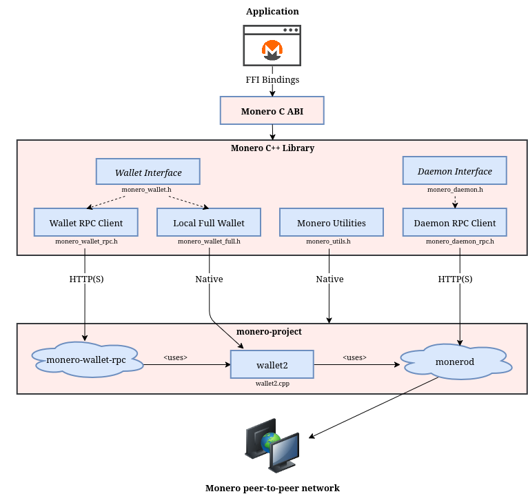

# Monero C ABI

[](https://github.com/libmonero/monero-c/actions/workflows/build.yml)
[](https://github.com/libmonero/monero-c/actions/workflows/test.yml)
[](https://app.codacy.com/gh/libmonero/monero-c/dashboard?utm_source=gh&utm_medium=referral&utm_content=&utm_campaign=Badge_grade)
[](https://app.codacy.com/gh/libmonero/monero-c/dashboard?utm_source=gh&utm_medium=referral&utm_content=&utm_campaign=Badge_coverage)

> [!WARNING]
>
> monero-c is currently under maintenance and unfunded, expect bugs and breaking changes.

A C ABI for creating Monero applications using RPC and FFI bindings to [monero v0.18.5.3 'Fluorine Fermi'](https://github.com/monero-project/monero/tree/v0.18.5.3).

* Supports wallet and daemon RPC clients.
* Supports client-side wallets using native bindings.
* Supports multisig, view-only, and offline wallets.
* Wallet types are interchangeable behind a common interface.
* Uses a clearly defined [data model and API specification](https://libmonero.github.io/monero-c/files.html) intended to be intuitive and robust.
* Query wallet transactions, transfers, and outputs by their properties.
* Fetch and process binary data from the daemon (e.g. raw blocks).
* Receive notifications when blocks are added to the chain or when wallets sync, send, or receive.

## Architecture

<p align="center">
	<br>
	<i>Build
     applications using FFI bindings to <a href="https://github.com/monero-project/monero">monero-project/monero</a>.  Wallet implementations are interchangeable by conforming to a common interface, <a href="https://woodser.github.io/monero-cpp/doxygen/classmonero_1_1monero__wallet.html">monero_wallet.h</a>.</i>
</p>

## Sample code

```c
#include <stdio.h>
#include "monero_c.h"

static void on_sync_progress(void* user_data, uint64_t height, uint64_t start_height, uint64_t end_height, double percent_done, const char* message) {
  // feed a progress bar?
}

static void on_output_received(void* user_data, const char* output_json) {
  // JSON-serialized monero_output_wallet, with the amount and the transaction
}

// connect to daemon
monero_daemon* daemon = NULL;
monero_daemon_connect("http://localhost:38081", "superuser", "abctesting123", "", 0, &daemon);
uint64_t height = 0;
monero_daemon_get_height(daemon, &height);                      // 1523651
char* txs_in_pool = NULL;
monero_daemon_get_tx_pool(daemon, &txs_in_pool);                // JSON array of monero_tx
monero_utils_free(txs_in_pool);

// create wallet from mnemonic phrase using native bindings to monero-project
monero_wallet* wallet_full = NULL;
monero_wallet_create_from_seed("sample_wallet_full", "supersecretpassword123", MONERO_UTILS_NETWORK_STAGENET,
                               "hefty value scenic...", "", 573936, NULL, &wallet_full);
monero_wallet_set_daemon_connection(wallet_full, "http://localhost:38081", "superuser", "abctesting123", "", NULL, true); // NULL trusts a local daemon

// synchronize the wallet and receive progress notifications
monero_wallet_listener_callbacks sync_callbacks = {NULL, on_sync_progress, NULL, NULL, NULL, NULL};
monero_wallet_listener* sync_listener = NULL;
monero_wallet_listener_create(&sync_callbacks, &sync_listener);
char* sync_result = NULL;
monero_wallet_sync(wallet_full, NULL, sync_listener, &sync_result);
monero_utils_free(sync_result);

// synchronize in the background every 5 seconds
monero_wallet_start_syncing(wallet_full, 5000);

// receive notifications when funds are received, confirmed, and unlocked
monero_wallet_listener_callbacks callbacks = {NULL, NULL, NULL, NULL, on_output_received, NULL};
monero_wallet_listener* listener = NULL;
monero_wallet_listener_create(&callbacks, &listener);
monero_wallet_add_listener(wallet_full, listener);

// connect to wallet RPC and open wallet
monero_wallet* wallet_rpc = NULL;
monero_wallet_rpc_open("http://localhost:38083", "rpc_user", "abc123", "sample_wallet_rpc", "supersecretpassword123", &wallet_rpc);
char* primary_address = NULL;
monero_wallet_get_primary_address(wallet_rpc, &primary_address); // 555zgduFhmKd2o8rPUz...
uint64_t balance = 0;
monero_wallet_get_balance(wallet_rpc, &balance);                // 533648366742
char* txs = NULL;
monero_wallet_get_txs(wallet_rpc, NULL, &txs);                  // JSON array of monero_tx_wallet
monero_utils_free(txs);

// send funds from RPC wallet to full wallet
char* address = NULL;
monero_wallet_get_primary_address(wallet_full, &address);
char tx_config[256];
snprintf(tx_config, sizeof(tx_config),
         "{\"accountIndex\":0,\"destinations\":[{\"address\":\"%s\",\"amount\":250000000000}],\"relay\":false}", address);
char* created_tx = NULL;
monero_wallet_create_tx(wallet_rpc, tx_config, &created_tx);   // "Are you sure you want to send... ?"
char* tx_hash = NULL;
monero_wallet_relay_tx_json(wallet_rpc, created_tx, &tx_hash); // relay the transaction
monero_utils_free(created_tx);
monero_utils_free(tx_hash);
monero_utils_free(address);
monero_utils_free(primary_address);

// save and close wallet
monero_wallet_close(wallet_full, true);
monero_wallet_free(wallet_full);
monero_wallet_free(wallet_rpc);
monero_wallet_listener_free(listener);
monero_wallet_listener_free(sync_listener);
monero_daemon_free(daemon);
```

Every call returns `MONERO_OK` or `MONERO_ERROR`, and `monero_last_error()` gives the message. The sample leaves the checks out.

## Documentation

* [API documentation](https://libmonero.github.io/monero-c/)
* [Coverage report](https://libmonero.github.io/monero-c/coverage/)
* [.NET bindings and NuGet package](docs/dotnet.md)

## Building monero-c from source

### Linux and macOS

1. Clone the project repository:
   ```bash
   git clone --recurse-submodules https://github.com/libmonero/monero-c.git
   ```
2. Build monero-project, monero-cpp and monero-c. Extra arguments are passed to cmake, e.g. `-DBUILD_TESTS=ON`:
   ```bash
   cd monero-c
   ./bin/build_libmonero_c.sh -DBUILD_TESTS=ON
   ```

Flags are cached in `./build/CMakeCache.txt`, so pass them on every build to change them. To sync submodules after pulling new changes, run `./bin/update_submodules.sh`.

### Windows

1. Download and install [MSYS2](https://www.msys2.org/).
2. Press the Windows button and launch `MSYS2 MINGW64`.
3. Update packages: `pacman -Syu` and confirm at prompts.
4. Relaunch MSYS2 (if necessary) and install dependencies:
   ```
   pacman -S mingw-w64-x86_64-toolchain mingw-w64-x86_64-cmake mingw-w64-x86_64-openssl mingw-w64-x86_64-zeromq mingw-w64-x86_64-libsodium mingw-w64-x86_64-hidapi mingw-w64-x86_64-unbound mingw-w64-x86_64-protobuf mingw-w64-x86_64-libusb mingw-w64-x86_64-expat mingw-w64-x86_64-ntldd git make gettext base-devel wget
   wget https://repo.msys2.org/mingw/mingw64/mingw-w64-x86_64-icu-76.1-1-any.pkg.tar.zst
   pacman -U mingw-w64-x86_64-icu-76.1-1-any.pkg.tar.zst
   wget https://repo.msys2.org/mingw/mingw64/mingw-w64-x86_64-boost-1.87.0-3-any.pkg.tar.zst
   pacman -U mingw-w64-x86_64-boost-1.87.0-3-any.pkg.tar.zst
   ```
5. Clone the repo: `git clone --recurse-submodules https://github.com/libmonero/monero-c.git`
6. Build monero-project, monero-cpp and monero-c. Extra arguments are passed to cmake, e.g. `-DBUILD_TESTS=ON`:
   ```
   cd monero-c
   ./bin/build_libmonero_c.sh -DBUILD_TESTS=ON
   ```

## Running tests

```
ctest --test-dir build --output-on-failure
```

The native unit tests in [tests/c/unit](tests/c/unit/) need nothing else. The native integration tests in [tests/c/integration](tests/c/integration/) call a regtest `monerod` and a `monero-wallet-rpc` server, so they are skipped unless `MONERO_C_TEST_DAEMON_URI` and `MONERO_C_TEST_WALLET_RPC_URI` point at them. The compose file starts both, with the same image that monero-python uses:

```
docker compose -f tests/c/integration/docker-compose.yml up -d
MONERO_C_TEST_DAEMON_URI=http://127.0.0.1:18081 MONERO_C_TEST_WALLET_RPC_URI=http://127.0.0.1:18082 ctest --test-dir build --output-on-failure
docker compose -f tests/c/integration/docker-compose.yml down -v
```

The wallet tests stop the wallet RPC server when they end, and the wallets they create stay in its volume, so run `down -v` and `up -d` before the next run.

All the tests include only the public header and call only exported functions, the same way a real FFI consumer would.

## Memory Ownership

Any `out_*` parameter that receives a string or byte buffer (`char**`, `uint8_t**`) is heap-allocated by monero_c and must be freed by the caller with `monero_utils_free()`, as shown above -- the sample's `monero_utils_free(json)` call is not optional. Fixed-size out-params (e.g. `uint8_t out_payment_id[32]`) write into a buffer the caller already owns, so there's nothing to free. See [src/utils/monero_c_utils.h](src/utils/monero_c_utils.h) for the one exception (`monero_last_error()`). Handles are released with their matching `*_free()` function: `monero_daemon_free()`, `monero_wallet_free()`, `monero_rpc_connection_free()` and the listener functions. A daemon or RPC wallet created from a `monero_rpc_connection` keeps the connection, so the connection handle can be freed right after. To save a full wallet, close it with `monero_wallet_close(wallet, true)` before freeing it. After a failed call, the string, buffer, array and handle outputs are NULL and the counts are 0, even when the failure was a NULL argument, so there is nothing to free.

## Limits

A JSON argument can't nest deeper than 64 levels, and a mnemonic can't be longer than 4096 bytes. `monero_daemon_get_blocks_by_range()` takes at most 100000 blocks per call, and `monero_daemon_get_blocks_by_range_chunked()` has no limit. A call over a limit fails with `MONERO_ERROR` before any parser or request runs.

## TLS

A connection to an `https` server checks the certificate against the CA certificates of the system, unless its `sslVerify` is false. The library carries its own OpenSSL, which looks for the certificates in the directory of the machine that built it, so on Linux and macOS the library sets `SSL_CERT_FILE` and `SSL_CERT_DIR` when it is loaded, to the bundle and the directory of the system (the Debian, Fedora, openSUSE, Alpine and macOS ones, and Android's directory). It leaves the environment alone if you set one of the two, or if OpenSSL finds the certificates by itself, as it does on Debian and Ubuntu. Windows reads the root store of the system, and nothing is set there.

## Thread Safety

> [!WARNING]
>
> Thread safety is incomplete. Some concurrent uses are still unsafe.

What holds today:

- monero-cpp serializes calls on one `monero_daemon` handle, so they don't run in parallel.
- monero-cpp locks a `monero_rpc_connection`, so one handle can be shared by several threads and by the daemons and RPC wallets created from it.
- Don't use one `monero_wallet` handle from two threads at once. `monero_wallet_start_syncing()` syncs on a thread owned by monero-cpp, next to the calls on the handle. The exception is `monero_wallet_request_shutdown()`, which makes the calls in flight return, so that a thread can wait for them and then close and free the wallet.
- Listener callbacks run on a thread owned by monero-cpp. Inside a callback, `monero_daemon_remove_listener()` and `monero_daemon_remove_listeners()` are safe. Don't free a wallet, a daemon or a listener from a callback.
- A wallet callback runs while the sync holds the lock of the wallet, so `monero_wallet_get_balance()`, `monero_wallet_get_unlocked_balance()`, `monero_wallet_get_txs()`, `monero_wallet_get_outputs()` and `monero_wallet_get_accounts()` called on that wallet from it never return. Copy what the callback gets and make those calls from another thread. A daemon callback can call the daemon.
- Different listeners on one daemon can be managed from different threads.
- One listener can be on one wallet at a time. Adding it to a second wallet fails.
- `monero_daemon_wait_for_next_block_header()` blocks only its calling thread, and other calls on the handle run meanwhile.
- `monero_last_error()` is per thread: it returns the last error of the calling thread.

## Related projects

* [monero-cpp](https://github.com/woodser/monero-cpp)
* [monero-java](https://github.com/woodser/monero-java)
* [monero-ts](https://github.com/woodser/monero-ts)
* [monero-python](https://github.com/everoddandeven/monero-python)
* [monero-csharp](https://github.com/libmonero/monero-csharp)

## License

This project is licensed under MIT.

## Donations

If this library has been valuable to you, please consider donating to support its continued development. 🙏

<p align="center">
  <code>XMR</code><br>
	<br>
	<code>852punAC8Ub7tLqrA2L72p3VVL9ZdjSAxUgryqcoiFSmLZnE7UJiHENCRYZboz6bETEmznh9tBSkGGWiPLWdigVm8AYgFcJ</code>
</p>